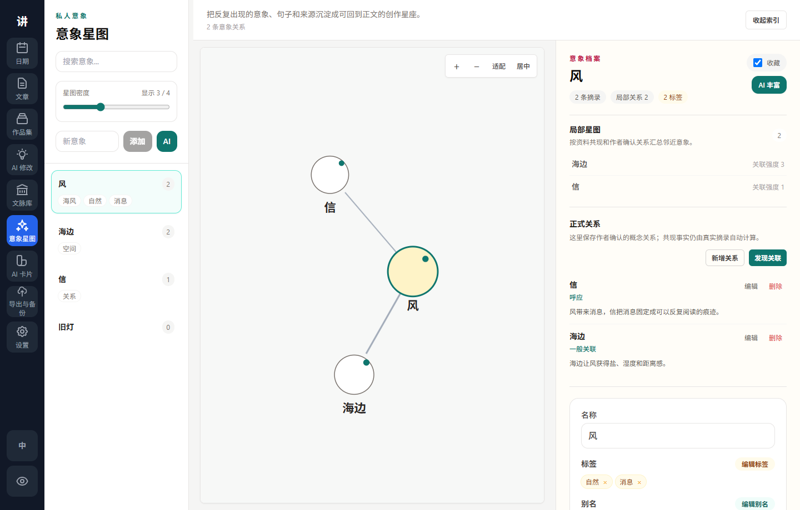

<div align="center">

# Living to Tell

**Write the work. Shape the book. Keep the author in control.**

A local-first Windows writing studio for long-form projects, traceable references, and reviewable AI.

[](https://github.com/sidiangongyuan/living-to-tell/releases/tag/living-to-tell-v0.1.49)
[](https://github.com/sidiangongyuan/living-to-tell/releases/latest)
[](#data-and-privacy)
[](LICENSE)

[**Download for Windows**](https://github.com/sidiangongyuan/living-to-tell/releases/download/living-to-tell-v0.1.49/LivingToTell_0.1.49_x64-setup.exe)
 · [中文说明](README.zh-CN.md)
 · [User guide](docs/user-guide.md)
 · [Visual tutorials](docs/tutorials.md)

<br>


<sub>Your drafts stay on your machine. AI runs only when you ask, and every write-back remains explicit.</sub>

</div>

## A writing workspace, not another text box

Living to Tell connects the parts of a serious writing practice that usually end up scattered across editors, boards, quote files, and AI chats. Draft an article, place it inside a book structure, keep the sources behind your ideas, and ask AI for help without surrendering the manuscript.

| Write with calm | Build the whole work | Use AI deliberately |
| --- | --- | --- |
| A focused long-form editor with autosave, notes, versions, epigraphs, search, and export. | Collections turn separate articles into an ordered manuscript, outline, planning board, and exportable book project. | Choose the exact model and context, watch long tasks progress, compare results, and confirm every change. |

## From a paragraph to a book

| 1. Write | 2. Organize | 3. Ground | 4. Assist | 5. Protect |
| :---: | :---: | :---: | :---: | :---: |
| Draft in **Articles** | Shape the manuscript in **Collections** | Keep sources in **References & Motifs** | Use **AI Edit, Cards & Agent** | Export, checkpoint, and back up |

Nothing is silently moved into the manuscript. References, motifs, AI context, model profiles, and proposed changes are all selected or confirmed by the author.

## See the workspace

### Keep a book-length conversation without giving up the manuscript


<sub>Named sessions, explicit modes, visible context, persistent drafts, and author-confirmed canon in one collection workspace.</sub>

| Shape a book project | Keep references readable |
| :---: | :---: |
|  |  |

| Choose writing references | Compare AI results |
| :---: | :---: |
|  |  |

| Configure one reliable default | Discuss the current article |
| :---: | :---: |
|  |  |

### See recurring ideas as author-confirmed relationships



<sub>Zoom and focus a D3 relationship map, distinguish empty concepts, and review AI-discovered candidates before creating any relationship or node.</sub>

| Start with a guided checklist | Review restore points |
| :---: | :---: |
|  |  |

The [visual tutorials](docs/tutorials.md) show seven complete workflows with short GIFs: first-run setup, article writing, collection planning, references and motifs, AI profiles and article editing, Collection Agent, and backup/export.

## Choose where to begin

| Your goal | Open | First action |
| --- | --- | --- |
| Start writing now | **Articles** | Select **New**, write, and let autosave handle the draft. |
| Plan a novel, essay collection, or nonfiction book | **Collections** | Create a project, add articles, then arrange parts, chapters, scenes, or notes in the manuscript tree. |
| Save a quotation or research passage | **Reference Library** | Create a reference with passage, title, author, purpose, and personal note. |
| Track a recurring image or idea | **Motif Star Map** | Select text in an article or reference, right-click, and link it to a motif. |
| Ask AI for writing help | **Settings**, then **AI Edit** | Save or import an AI profile, send a real test request, then open an article and run a focused edit. |
| Check recovery before a long session | **Export & Backup** | Review the latest checkpoint and create a backup when needed. |

### A practical first project

1. Create an article and write one real scene, essay fragment, or argument.
2. Create a collection and add that article to it.
3. Add a chapter or scene node, then link the article to the node.
4. Add one source passage to the Reference Library and link important text to a motif if useful.
5. Optionally configure AI and run a small task before sending longer text.
6. Open Export & Backup, create a restore point, and export the article or collection.

Prefer learning by exploring? The first-run checklist can create a disposable sample project. It is opt-in, clearly labeled, and removable without touching your own work.

## The workspace

| Area | What it gives you |
| --- | --- |
| **Article Studio** | Autosave, tags, full-text search, find/replace, writing notes, version history, epigraphs, focus mode, motif anchors, and Markdown/TXT/DOCX export. |
| **Collections** | Searchable project shelf, manuscript hierarchy, unplanned articles, linked drafts, status board, guided tour, ordered export, and project-level Agent. |
| **Collection Agent** | A collection-bound coauthor with named sessions, `Discuss / Plan / Draft / Review` modes, layered memory, explicit context, a persistent draft library, and reviewable proposals. Collapsible session and workspace panels keep the conversation readable. |
| **Reference Library** | Reading-first passages with source, author, purpose, personal notes, grouped browsing, highlighted search matches, keyboard navigation, and complete citation copy. |
| **Motif Star Map** | Bidirectional source anchors, real excerpt co-occurrence, author-confirmed formal relationships, review-first AI discovery, D3 zoom/focus navigation, structured concept archives, and optional AI enrichment. |
| **AI Edit** | Article-bound polish, rewrite, expand, and continue tools with equal large pickers for reference specimens, AI Cards, and article notes; explicit model selection, recoverable multi-model runs, paragraph diff, and versioned write-back. |
| **Article AI Chat** | A closable article-side drawer for discussion. Its draft, thread, and in-flight reply survive closing; saving a reply elsewhere always requires an explicit action. |
| **AI Cards** | Reusable style, character, and scene modules with reading-first templates, search, prompt copy, selected model profiles, and recoverable background generation. |
| **Export & Backup** | Article and collection export, restore-point review, backups, checkpoints, reminders, data-path visibility, and copy-based data-directory migration. |

## AI on your terms

AI is optional. The writing, collection, reference, motif, export, and backup workflows work without it.

- Use OpenAI-compatible endpoints, Codex local auth, Gemini API or Gemini CLI/OAuth, and OpenCode local auth.
- Keep several independent AI profiles, each with its own provider, model, endpoint, local credential source, and visible health state; choose exactly one default profile for single-model features.
- Run one or many explicitly selected profiles in AI Edit; selecting a non-default profile replaces the sole default selection, and the default is never silently added back.
- Choose reference specimens, AI Cards, and current-article notes through three large searchable pickers. Only confirmed material is attached, every model receives the same frozen set, and specimen prompts forbid copying sentences or importing specimen facts and names.
- Create profiles through the three-step setup wizard, run free local checks first, and send a minimal real request only for the profiles you select. Real tests may use tokens and incur provider cost.
- Long-running jobs remain visible when you leave and return to the feature. Reconnection checks task state and does not resend the provider request.
- Collection Agent carries a visible session summary plus recent turns, while confirmed canon stays separately in the Project Bible. Conversations and rejected proposals never become memory by accident.
- Agent scene drafts are stored locally outside the manuscript. Creating an article, appending, or replacing an explicit selection always requires a preview; existing article write-back creates a version snapshot first.
- Generated text, card drafts, motif enrichment, project-memory changes, and Agent actions stay in preview or proposal form until you approve them.

See the [user guide](docs/user-guide.md) for provider-specific AI setup instructions.

## Download and install

The current public preview supports Windows x64.

- Recommended: [`LivingToTell_0.1.49_x64-setup.exe`](https://github.com/sidiangongyuan/living-to-tell/releases/download/living-to-tell-v0.1.49/LivingToTell_0.1.49_x64-setup.exe)
- MSI package: [`LivingToTell_0.1.49_x64_zh-CN.msi`](https://github.com/sidiangongyuan/living-to-tell/releases/download/living-to-tell-v0.1.49/LivingToTell_0.1.49_x64_zh-CN.msi)
- Release notes and older builds: [GitHub Releases](https://github.com/sidiangongyuan/living-to-tell/releases)

Preview installers are currently unsigned, so Windows SmartScreen may show a warning. Only run installers downloaded from this repository's Release page.

## Data and privacy

- Writing data is stored locally in SQLite at `%APPDATA%\LivingToTell\LivingToTell\living-to-tell.sqlite3` by default.
- Uninstalling the app does not delete the writing database, backups, or checkpoints.
- AI requests are sent only when you explicitly run a tool, start an Agent task, or send a chat message.
- API keys are read from environment variables or local provider configuration. Saved profiles store credential references, not raw keys.
- Data-directory migration copies data to the selected folder and leaves the previous folder intact.
- The sample project is never created automatically and can be removed independently of user content.

Before major edits, review the active data path and create a checkpoint or backup from **Export & Backup**.

## Documentation

| Read | Use it for |
| --- | --- |
| [User guide](docs/user-guide.md) · [中文](docs/user-guide.zh-CN.md) | Installation, first project, every workspace, AI setup, storage, and recovery. |
| [AI troubleshooting](docs/ai-troubleshooting.md) · [中文](docs/ai-troubleshooting.zh-CN.md) | Profile health, access methods, safe diagnostics, transport, timeouts, and cost behavior. |
| [Visual tutorials](docs/tutorials.md) · [中文](docs/tutorials.zh-CN.md) | Seven short GIF walkthroughs of the core workflow. |
| [Changelog](tauri-mvp/CHANGELOG.md) | User-visible changes by release. |
| [Roadmap](docs/roadmap.md) and [TODO](docs/todo.md) | Planned product work and current priorities. |
| [Contributing](CONTRIBUTING.md) and [Security](SECURITY.md) | Development standards and responsible reporting. |

## Project status

Living to Tell is a public Windows preview under active development. Articles, collections, references, motifs, AI workflows, and backup/export are usable today. macOS and Linux packages, signed Windows installers, and optional sync are future work.

The public repository avoids private writing samples, credentials, local databases, and generated build artifacts. Demo screenshots use disposable sample content.

## Development

The desktop app uses Vue 3 + TypeScript + Tauri 2, with a local FastAPI/Python backend and SQLite storage. See [the developer guide](tauri-mvp/README.md) for environment setup, architecture, tests, and release commands.

```powershell
python -m pytest tests\test_tauri_mvp_api.py -q
cd tauri-mvp\frontend
npm test -- --run
npm run build
cargo check --manifest-path src-tauri\Cargo.toml
```

## License

[MIT License](LICENSE)
