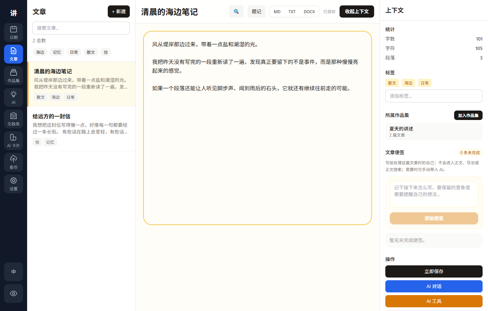
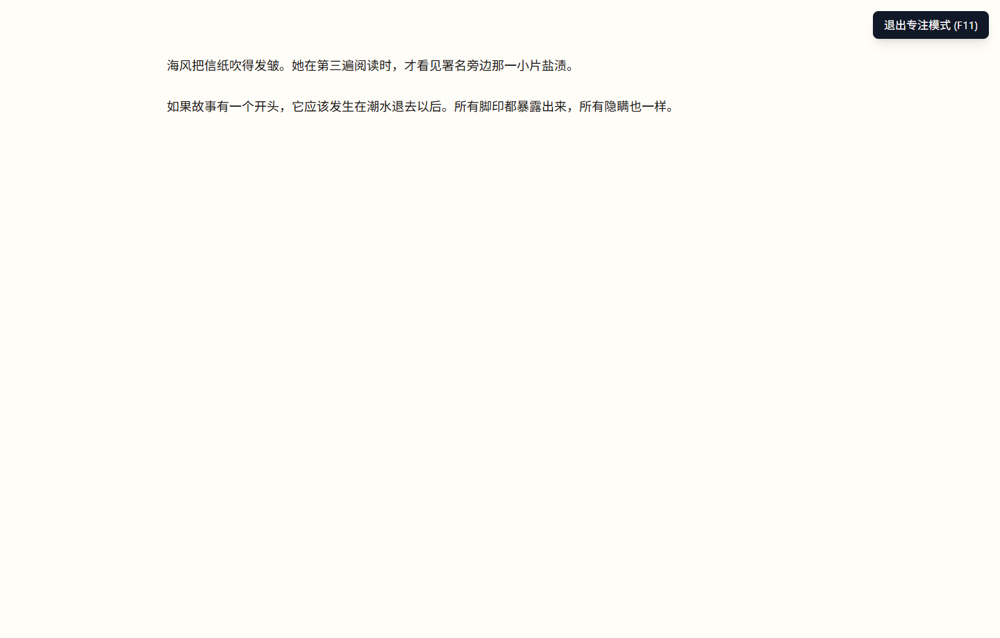
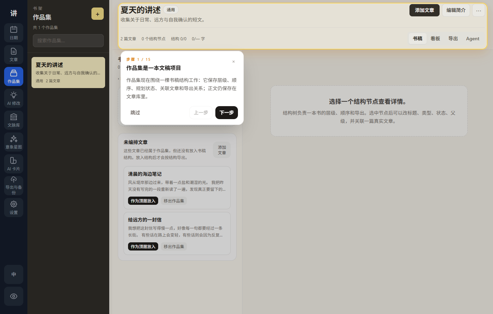
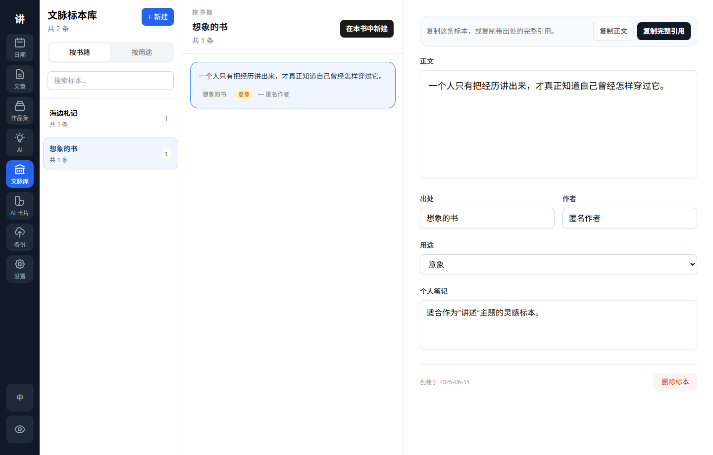
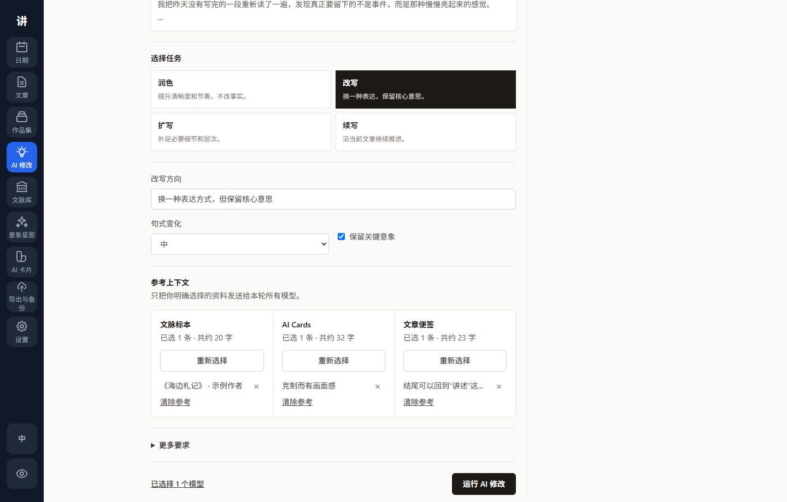
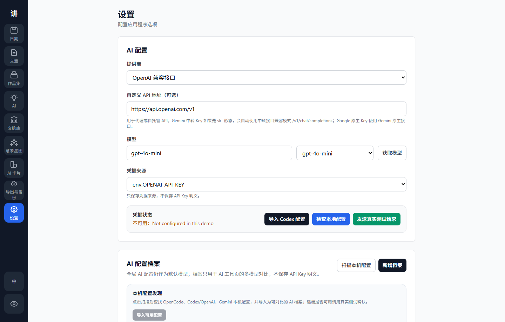

<div align="center">

# Writer

### A local-first writing studio for articles, collections, references, and scoped AI

[中文](README.zh-CN.md) · English · [Download](https://github.com/sidiangongyuan/writer/releases/tag/tauri-v0.1.6)

[](tauri-mvp/CHANGELOG.md)
[](https://github.com/sidiangongyuan/writer/releases)
[](https://tauri.app/)
[](tauri-mvp/README.md)
[](LICENSE)

**Write articles. Arrange collections. Keep references. Talk with AI without losing control of the manuscript.**

[Download for Windows](https://github.com/sidiangongyuan/writer/releases/tag/tauri-v0.1.6) · [Screenshots](#screenshots) · [Features](#features) · [AI Setup](#ai-setup) · [Roadmap](#roadmap--todo)

</div>

---

Writer is a desktop writing app for people who work with long text, fragments, quotes, and revision ideas. It keeps the writing database local, lets you organize articles into collections, and treats AI output as something you review before applying.

## At a Glance

| | |
| --- | --- |
| **📝 Article Studio** | Draft long-form writing with autosave, tags, search, epigraphs, focus mode, and export. |
| **📚 Collections** | Arrange multiple articles into a reading order and export them as a collected manuscript. |
| **🔖 Reference Library** | Keep quotes, sources, authors, usage notes, and citation-ready snippets in one place. |
| **🤖 Scoped AI** | Use task tools or persistent chat for an article, a collection, or the whole workspace. |
| **🧠 AI Cards** | Save reusable style, character, and setting context for later prompts. |
| **🔒 Local First** | Store writing data locally and send text to AI only when you explicitly run an AI action. |

## Current Preview Status

| Area | Status |
| --- | --- |
| Windows desktop app | ✅ Public preview available |
| Article writing | ✅ Usable |
| Collections | ✅ Usable |
| Reference library | ✅ Usable |
| AI tools and scoped chat | ✅ Usable after provider setup |
| Dark mode | 🚧 Hidden until the theme pass is complete |
| macOS / Linux packages | 🗓️ Planned after Windows stabilizes |

## Why Writer

| If you often... | Writer gives you... |
| --- | --- |
| Draft essays, fiction, notes, or serialized articles | A calm article editor with autosave, tags, search, epigraphs, and export |
| Need to turn many articles into one larger work | Collections with ordering, preview, and book-style export |
| Save quotes from books or reading material | A reference library grouped by source book or usage |
| Use AI but worry about accidental overwrites | Scoped AI tools and chat that never apply changes without your action |
| Want a local writing workflow | Local SQLite data, explicit AI calls, and manual backups/checkpoints |

## Screenshots

| Article Writing | Focus Mode |
| :---: | :---: |
|  |  |

| Collections | Reference Library |
| :---: | :---: |
|  |  |

| AI Workspace | Settings |
| :---: | :---: |
|  |  |

## Features

### Writing

- Article editor with autosave, tags, full-text search, find/replace, and a collapsible context pane.
- Epigraph editing for opening quotes, with clean Markdown, TXT, and DOCX export.
- Pure focus mode that leaves only the writing area and an exit control.
- Date view for browsing daily writing activity, with a direct start-writing button on empty days.

### Collections

- Build article collections from multiple articles.
- Add articles in batches, then reorder with drag-and-drop or up/down controls.
- Preview the selected article in a paper-like reading pane.
- Export a collection in Markdown, TXT, or DOCX using the current order.

### Reference Library

- Save reference passages with source title, author, usage type, and personal notes.
- Browse references by source book or usage.
- Jump from the daily quote card to the matching reference passage.
- Copy the passage body, or copy a complete citation with title and author.

### AI Workspace

- Task tools for polishing, rewriting, expanding, continuing, summarizing, outlining, and title generation.
- Free chat with one ongoing conversation per global scope, article, or collection.
- AI Cards for reusable style, character, and setting context, with type/source filters and keyword search.
- Supports OpenAI-compatible APIs, Codex local auth, Gemini API/local config, and Gemini CLI / OAuth.
- Writer stores the selected credential source, not raw API keys.

### Desktop Experience

- Windows desktop preview with a simple installer.
- Close behavior can be set to ask every time, minimize to tray, or exit directly.
- Public preview uses light mode only while the dark theme is being polished.

## Download

Download the latest public preview from [GitHub Releases](https://github.com/sidiangongyuan/writer/releases/tag/tauri-v0.1.6).

Recommended Windows asset:

- `Writer_0.1.6_x64-setup.exe`

Optional assets:

- `Writer_0.1.6_x64_en-US.msi`

Windows SmartScreen may warn because preview builds are unsigned. Only run installers downloaded from this repository's release page.

## Quick Start

1. Install Writer from the latest Release.
2. Open Articles and start a new article.
3. Use Collections to arrange multiple articles into a reading order.
4. Save quotes and sources in the Reference Library.
5. Configure AI in Settings if you want AI tools or scoped chat.

## AI Setup

Open Settings and choose one provider:

- OpenAI-compatible: set a base URL/model and use `env:OPENAI_API_KEY` or Codex local auth.
- Gemini API: use `env:GEMINI_API_KEY` or import local Gemini configuration.
- Gemini CLI / OAuth: reuse a local Gemini CLI login. No API key field is required.

Long Gemini requests default to a 120 second wait. Advanced users can tune this with `WRITER_GEMINI_TIMEOUT_SECONDS` or `WRITER_GEMINI_CLI_TIMEOUT_SECONDS`.

## Data & Privacy

- Writing data is stored locally in Writer's SQLite database.
- AI requests are sent only when you run an AI tool or send a chat message.
- API keys are read from environment variables or local provider configuration at runtime.
- Writer settings store the selected provider and credential source, not raw API keys.
- Use backups/checkpoints before major editing sessions.

## Recently Completed

- Public Windows preview with article writing, collections, references, and scoped AI.
- Clean screenshot set for the main writing, collection, reference, AI, and settings views.
- Epigraph editing, focus mode, and Markdown / TXT / DOCX export.
- AI tools, scoped chat, AI Cards, and Gemini / OpenAI-compatible setup.
- Daily writing view with reference quote links and one-click start writing.

## Roadmap / TODO

The public TODO list is kept visible but folded so the README stays readable.

<details>
<summary>Show detailed TODO checklist</summary>

### First-Run Experience

- [ ] Improve first-run onboarding for language, data location, backups, and AI provider setup.
- [ ] Add a sample project so new users can understand the workflow quickly.
- [ ] Re-enable dark mode after a complete visual pass.

### Writing

- [ ] Add editor layout presets for compact, balanced, and wide screens.
- [ ] Improve keyboard-only navigation across Dates, Articles, Collections, and AI Workspace.
- [ ] Add optional backup reminders for active daily writers.
- [ ] Add richer collection publishing options such as cover notes, section dividers, and saved export presets.

### AI

- [ ] Improve AI revision comparison with clearer original-vs-result review.
- [ ] Add visible long-text request size, wait-time, and timeout guidance.
- [ ] Add saved AI context sets for repeated article and collection workflows.
- [ ] Expand clickable AI reports so issues can locate source text or become follow-up tasks.
- [ ] Add Claude / Anthropic support after the provider backend is complete.

### Knowledge & Planning

- [ ] Add a mind map view for articles and collections, so writers can organize themes, plot threads, arguments, references, and AI-generated ideas visually.
- [ ] Add more ways to turn AI chat ideas into articles, notes, reference passages, and future tasks.
- [ ] Add richer reference-library views for large reading collections.

### Platform

- [ ] Add signed Windows builds or published checksums for preview installers.
- [ ] Evaluate macOS and Linux packaging after the Windows workflow is mature.
- [ ] Add a troubleshooting page for AI provider setup.

</details>

See the full list in [docs/todo.md](docs/todo.md).

## Development

See [tauri-mvp/README.md](tauri-mvp/README.md) for development commands.

Quick verification:

```powershell
D:\anaconda\envs\writer\python.exe -m pytest
cd tauri-mvp\frontend
npm test
npm run build
cargo check --manifest-path src-tauri\Cargo.toml
```

## License

MIT License. See [LICENSE](LICENSE).
