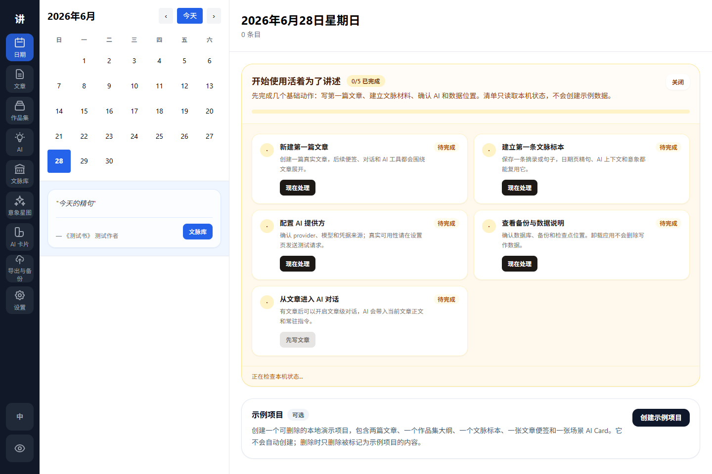
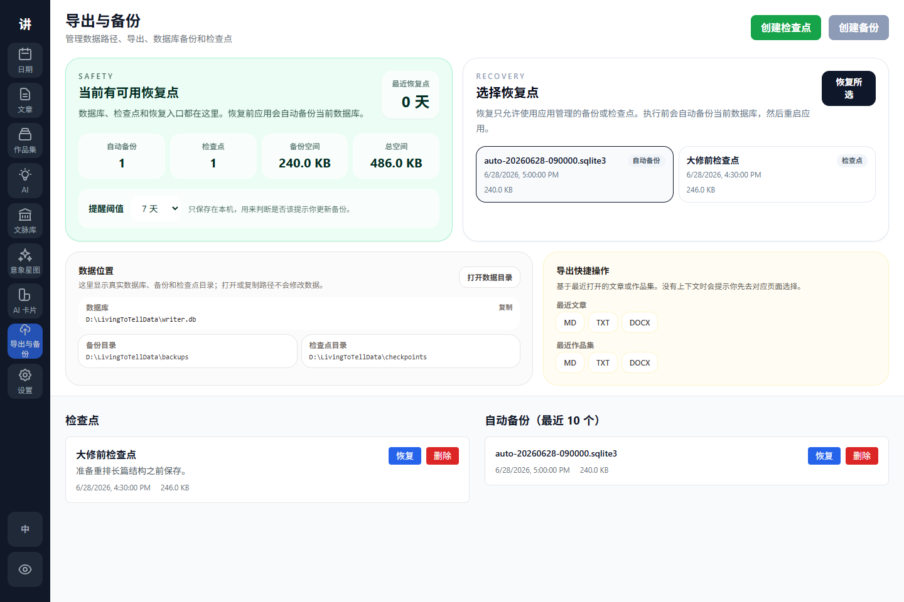

<div align="center">

# Living to Tell

### A local-first writing studio for articles, collections, references, and scoped AI

[中文](README.zh-CN.md) · English · [Download](https://github.com/sidiangongyuan/living-to-tell/releases/tag/living-to-tell-v0.1.27)

[](tauri-mvp/CHANGELOG.md)
[](https://github.com/sidiangongyuan/living-to-tell/releases)
[](https://tauri.app/)
[](tauri-mvp/README.md)
[](LICENSE)

**Writing, photography, singing, and speaking are all ways to tell. To live is to tell.**

[Download for Windows](https://github.com/sidiangongyuan/living-to-tell/releases/tag/living-to-tell-v0.1.27) · [User Guide](docs/user-guide.md) · [GIF Tutorials](docs/tutorials.md) · [Screenshots](#screenshots) · [Features](#features) · [AI Setup](#ai-setup) · [Roadmap](#roadmap--todo)

</div>

---

Living to Tell is a desktop writing app for long text, fragments, quotes, revision ideas, and AI-assisted writing that stays under your control. It keeps the writing database local, lets you arrange articles into collections, and treats AI output as something to review before applying.

## At a Glance

| | |
| --- | --- |
| **Article Studio** | Draft long-form writing with autosave, tags, search, epigraphs, focus mode, notes, version history, and export. |
| **Collections** | Arrange articles into a manuscript and plan longer projects with outline items, planning board, progress summaries, filters, and Markdown outline export. |
| **Reference Library** | Keep quotes, source titles, authors, usage notes, and citation-ready snippets in one place. |
| **Article AI** | Use focused AI tools, compare multiple configured models, and keep every write-back explicit. |
| **AI Cards** | Save reusable style, character, and scene cards with templates and AI-assisted draft generation. |
| **Motif Star Map** | Mark selected text as motifs, revisit source anchors, explore co-occurrence, and enrich concepts with AI. |
| **Export & Backup** | Review restore points, local data paths, backups/checkpoints, storage folders, backup reminders, and recent article/collection exports. |
| **Local First** | Store writing data locally and send text to AI only when you explicitly run an AI action. |

## Current Preview Status

| Area | Status |
| --- | --- |
| Windows desktop app | Public preview available |
| Article writing | Usable |
| Collections | Usable |
| Reference library | Usable |
| Article AI tools and chat | Usable after provider setup |
| Motif star map | Usable preview |
| Data directory migration | Usable from Settings |
| Dark mode | Hidden until the theme pass is complete |
| macOS / Linux packages | Planned after Windows stabilizes |

## Screenshots

For step-by-step walkthroughs, open the [GIF tutorials](docs/tutorials.md). They cover the sample project, article writing, collection planning, references and motifs, AI with AI Cards, and Export & Backup.

| Article Writing | Focus Mode |
| :---: | :---: |
|  |  |

| Collections | Reference Library |
| :---: | :---: |
|  |  |

| AI Workspace | Settings |
| :---: | :---: |
|  |  |

| First-Run Checklist | Export & Backup |
| :---: | :---: |
|  |  |

## Features

### Writing

- Article editor with autosave, tags, full-text search, find/replace, and a collapsible context pane.
- Article notes for reminders, fragments, and next-step ideas that stay out of the manuscript.
- Article version history with manual checkpoints, AI-before-apply snapshots, pre-restore snapshots, paragraph comparison, restore, clone, copy, and delete actions.
- Epigraph editing for opening quotes, with clean Markdown, TXT, and DOCX export.
- Focus mode that leaves only the writing area and an exit control.
- Date view for browsing daily writing activity, with a direct start-writing button on empty days.

### Collections

- Build article collections from multiple articles.
- Add articles in batches, then reorder with drag-and-drop or up/down controls.
- Preview the selected article in a paper-like reading pane.
- Switch to the outline tab to plan long-form projects with part, chapter, scene, and note cards.
- Track outline status, summary, point of view, timeline, setting, tags, target word count, and linked article.
- Use the planning board to scan idea, draft, revision, done, and parked items across the whole collection.
- Create a linked article from an outline item or connect an existing article to the plan.
- Export a collection in Markdown, TXT, or DOCX using the current order.

### Reference Library

- Save reference passages with source title, author, usage type, and personal notes.
- Browse references by source book or usage.
- Jump from the daily quote card to the matching reference passage.
- Copy the passage body, or copy a complete citation with title and author.

### Motif Star Map

- Select text in an article or reference passage, right-click, and save it to one or more motifs.
- Reopen an existing source selection without creating duplicate excerpts.
- Use source anchors to jump from the article context pane back to the marked sentence.
- Explore a literary star map where node size, color, and links reflect excerpt usage and co-occurrence.
- Use **AI Enrich** in the detail pane to turn concepts such as mythic pattern, slave morality, or das Man into compact writing cards.
- Read enriched motifs as structured concept archives with definition, tension, writing functions, examples, warnings, and exercises instead of one long note.
- Review AI-suggested reference sentence candidates before importing them into the Reference Library and linking them to the current motif.
- Remove an excerpt from the current motif without deleting the same excerpt from other motifs.

### AI Workspace

- Focused task tools for polish, rewrite, expand, and continue, each with its own controls.
- Article-scoped chat keeps one ongoing conversation per article.
- AI replies in article chat can be copied, saved as article notes, or reviewed in a capture dialog before saving as reference material or a new article.
- Standing chat instructions let you keep long-term style preferences without rewriting them in every message.
- AI results are previewed before writing back, with explicit replace, insert, and copy actions.
- Long AI requests show size, paragraph, estimated-token, and selected-model diagnostics before running, then show honest pending cards while models are still working.
- AI Tools can run the same task across up to three saved AI profiles and compare output length, paragraph changes, latency, tokens, and cost when available.
- Personal presets for each writing tool.
- AI Cards for reusable style, character, and scene modules, with fixed templates, AI-assisted draft generation, type/source filters, and keyword search.
- Scene modules can be searched and manually attached to AI tasks, so narrative structure is sent only when you choose it.
- Supports OpenAI-compatible APIs, Codex local auth, Gemini API/local config, Gemini CLI / OAuth, and OpenCode local auth.

### Desktop Experience

- Windows desktop preview with a simple installer.
- Light startup splash gives immediate feedback while the bundled backend is starting.
- First-run onboarding can create an explicit disposable sample project with articles, a collection outline, a reference, a writing note, and a scene AI Card. It is never created automatically and can be removed without touching user content.
- The app checks GitHub Releases in the background after startup and shows a clear update notice when a newer public build is available.
- Close behavior can be set to ask every time, minimize to tray, or exit directly.
- Export & Backup now centers restore points first: it shows the latest backup/checkpoint state, lets you choose a restore point, reminds you when backups are stale, and still auto-backs up before restore.
- Data and Storage settings show the active SQLite database, backup folder, checkpoint folder, and custom data-directory status.
- Data-directory migration copies data to the new location and leaves the previous folder untouched.
- Public preview uses light mode only while the dark theme is being polished.

## Download

Download the latest public preview from [GitHub Releases](https://github.com/sidiangongyuan/living-to-tell/releases/tag/living-to-tell-v0.1.27).

Recommended Windows asset:

- `LivingToTell_0.1.27_x64-setup.exe`

Optional asset:

- `LivingToTell_0.1.27_x64_zh-CN.msi`

Windows SmartScreen may warn because preview builds are unsigned. Only run installers downloaded from this repository's release page.

## Quick Start

1. Install Living to Tell from the latest Release.
2. Follow the [official user guide](docs/user-guide.md) for installation, data path, and backup checks.
3. Use the Date view checklist to create a first article, review backups, or create the optional sample project.
4. Open the [GIF tutorials](docs/tutorials.md) if you want to see the six core workflows first.
5. Open Articles and start writing, or open the sample collection to inspect the long-form workflow.
6. Use Collections to arrange multiple articles into a reading order and plan outlines.
7. Save quotes and sources in the Reference Library.
8. Configure AI in Settings if you want AI tools or scoped chat.

## AI Setup

Open Settings and choose one provider:

- OpenAI-compatible: set a base URL/model, choose the right wire API, and use `env:OPENAI_API_KEY` or Codex local auth.
- Gemini API: use `env:GEMINI_API_KEY` or import local Gemini configuration.
- Gemini CLI / OAuth: reuse a local Gemini CLI login. No API key field is required.
- OpenCode: reuse a local `opencode auth login` session. No API key field is required, and Settings can fetch the current OpenCode model list.

For multi-model comparison, use **AI profiles → Scan Local Configs** to discover local OpenCode, Codex/OpenAI, and Gemini configs, then import them as selectable profiles. Discovery only checks local config files and auth sources; use **Send Real Test Request** to verify the remote model actually works.

OpenCode model fetching is live. On the current local OpenCode setup, the available models include:

- `opencode/big-pickle`
- `opencode/deepseek-v4-flash-free`
- `opencode/mimo-v2.5-free`
- `opencode/nemotron-3-ultra-free`
- `opencode/north-mini-code-free`

Settings separates **Check Local Config** from **Send Real Test Request**. The first only checks local credential sources; the second sends a short sample request to verify the provider, model, base URL, key, and internal transport.

Gemini proxy keys shaped like `sk-...` with a custom base URL automatically use the gateway-compatible `/v1/chat/completions` transport while staying configured as the Gemini provider.

Long Gemini requests default to a 120 second wait. Advanced users can tune this with `WRITER_GEMINI_TIMEOUT_SECONDS` or `WRITER_GEMINI_CLI_TIMEOUT_SECONDS`.

## Data & Privacy

- Writing data is stored locally in SQLite at `%APPDATA%\LivingToTell\LivingToTell\living-to-tell.sqlite3` by default.
- The Windows installer usually places app files under `%LOCALAPPDATA%\活着为了讲述`; this is separate from your writing database.
- Uninstalling the app does not delete the writing database, backups, or checkpoints.
- You can review, open, and safely migrate the data directory from **Settings → Data and Storage**. Migration copies data to the new folder and keeps the old folder intact.
- First launch copies old Writer data from `%APPDATA%\Writer\Writer\writer.sqlite3` into the new location if it exists. The old database is retained.
- AI requests are sent only when you run an AI tool or send a chat message.
- API keys are read from environment variables or local provider configuration at runtime.
- Settings store the selected provider and credential source, not raw API keys.
- Use backups/checkpoints before major editing sessions.

## Recently Completed

- Renamed the public app to Living to Tell / 活着为了讲述.
- Added article version history with manual checkpoints, AI-before-apply protection, paragraph comparison, restore, clone, copy, and delete actions.
- Added a collection-level outline tab for long-form projects, with part/chapter/scene/note planning and linked article creation.
- Added a motif star map with right-click text capture, source anchors, co-occurrence links, deduplication, and safer unlink behavior.
- Added article-scoped AI chat, standing instructions, copy actions, and save-as-note actions.
- Added first-run checklist progress, AI settings diagnostics, long-request size feedback, and grouped global command palette search.
- Added an explicit disposable sample project that demonstrates articles, collection outline planning, references, notes, and scene AI Cards without modifying user content automatically.
- Expanded Export & Backup into a recovery-focused center with restore-point selection, data-path visibility, backup reminders, and recent article/collection export shortcuts.
- Enhanced collection outlines with a planning board for long-form projects, showing outline cards grouped by status.
- Added reference-library overview cards and current-group summaries for source count, duplicate hints, usage distribution, and character totals.
- Added AI chat capture previews so assistant replies can be reviewed before saving as reference material or new articles.
- Upgraded AI Cards into style / character / scene templates, added AI draft generation, and added manual scene-module attachment for AI tasks.
- Added AI provider profiles and multi-model comparison in AI Tools, with per-result statistics and explicit winner selection before write-back.
- Added OpenCode local-auth support, live OpenCode model fetching, and real OpenCode test requests through the unified AI provider path.
- Reworked motif details into structured concept archives and added user-approved AI reference candidate import into the Reference Library.
- Added a real AI connectivity test and fixed Gemini proxy transport selection for `sk-...` keys behind custom base URLs.
- Added Data and Storage settings with directory display, open-folder actions, and copy-based migration.
- Added a Tauri startup splash so cold starts show immediate progress instead of a blank window.
- Hid the uninstall-time app-data deletion option and clarified that uninstalling does not delete writing data.
- Added article notes, focused AI writing controls, per-tool presets, and explicit AI apply actions.
- Added reliable article-position restore, wider writing layout, and typewriter-style end-of-document spacing.
- Added daily writing view with reference quote links and one-click start writing.
- Added close-button behavior with native ask / tray / exit choices.

## Roadmap / TODO

The public TODO list is kept visible but folded so the README stays readable.

<details>
<summary>Show detailed TODO checklist</summary>

### First-Run Experience

- [x] Add a first-run checklist that reads local state without creating sample data.
- [ ] Improve first-run onboarding for language, data location, backups, and AI provider setup.
- [x] Add a sample project so new users can understand the workflow quickly.
- [ ] Re-enable dark mode after a complete visual pass.

### Writing

- [x] Add article notes for keeping fragmentary ideas beside the current article.
- [x] Restore the last article editing position and make long-form writing more comfortable near the end of a document.
- [x] Add article version history with restore and clone flows.
- [ ] Add editor layout presets for compact, balanced, and wide screens.
- [ ] Improve keyboard-only navigation across Dates, Articles, Collections, and AI Workspace.
- [x] Add collection-level outline planning for long-form projects.
- [x] Add a collection planning board for outline status review.
- [ ] Add richer collection publishing options such as cover notes, section dividers, and saved export presets.

### AI

- [x] Make AI results safer to apply with clearer original-vs-result comparison and explicit replace / insert / copy actions.
- [x] Give polish, rewrite, expand, and continue their own focused controls.
- [x] Let users save personal prompt presets for each writing tool.
- [x] Add article-scoped AI chat with standing instructions and save-reply-as-note.
- [x] Add style / character / scene AI Cards with structured templates and AI-assisted draft generation.
- [x] Add manual scene-module search and attachment for AI tasks.
- [x] Add a real AI connectivity test that reports provider, model, transport, and response preview.
- [x] Add OpenCode local-auth support with live model fetching for OpenCode models.
- [x] Add clearer long-text request size, wait-time, and timeout feedback.
- [x] Make it easier to turn AI chat ideas into articles, notes, or reference material.

### Knowledge & Planning

- [x] Add a motif star map for organizing recurring images, symbols, and source excerpts visually.
- [x] Add compact reference-library overview and active-group summaries.
- [ ] Add richer graph views for themes, character links, arguments, references, and AI-generated ideas.
- [ ] Add richer reference-library views for large reading collections.

### Platform

- [x] Add visible Data and Storage settings with copy-based data-directory migration.
- [x] Expand Export & Backup with restore-point selection, safety summary, paths, and backup reminders.
- [x] Keep uninstall from deleting writing data by default.
- [ ] Add optional cloud sync for writers who want the same local-first workspace across devices.
- [ ] Add signed Windows builds or published checksums for preview installers.
- [ ] Evaluate macOS and Linux packaging after the Windows workflow is mature.
- [ ] Add a troubleshooting page for AI provider setup.

</details>

See the full list in [docs/todo.md](docs/todo.md).

## Development

See [tauri-mvp/README.md](tauri-mvp/README.md) for development commands.

Quick verification:

```powershell
python -m pytest
cd tauri-mvp\frontend
npm test
npm run build
cargo check --manifest-path src-tauri\Cargo.toml
```

## License

MIT License. See [LICENSE](LICENSE).
