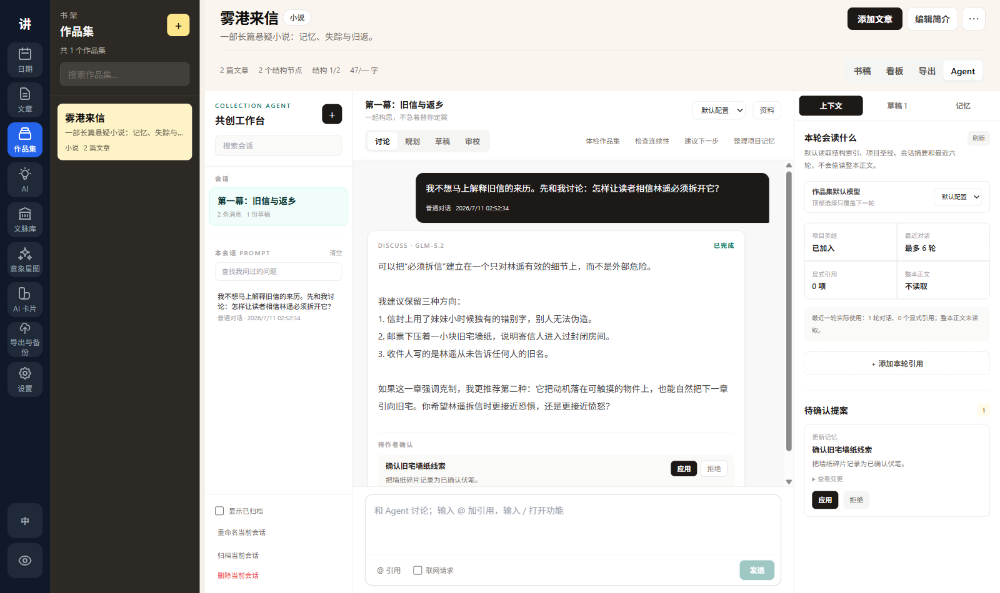

<div align="center">

# 活着为了讲述

**写下作品，组织成书，把决定权留给作者。**

一款面向 Windows 的本地优先写作工作室：适合长篇项目、可追溯文脉，以及需要作者确认的 AI 协作。

[](https://github.com/sidiangongyuan/living-to-tell/releases/tag/living-to-tell-v0.1.45)
[](https://github.com/sidiangongyuan/living-to-tell/releases/latest)
[](#数据与隐私)
[](LICENSE)

[**下载 Windows 安装包**](https://github.com/sidiangongyuan/living-to-tell/releases/download/living-to-tell-v0.1.45/LivingToTell_0.1.45_x64-setup.exe)
 · [English](README.md)
 · [使用手册](docs/user-guide.zh-CN.md)
 · [动态教程](docs/tutorials.zh-CN.md)

<br>


<sub>稿件保存在本机。只有你主动运行时才会调用 AI，任何写回都需要明确操作。</sub>

</div>

## 这是一套写作工作流，不只是一个输入框

认真写作时，正文、书稿结构、阅读摘录、灵感便签、版本备份和 AI 对话经常散落在不同软件里。活着为了讲述把这些环节放进同一个工作区：先写文章，再组织成书；保留想法背后的出处，需要 AI 时也不交出书稿的决定权。

| 安静地写 | 看见整部作品 | 有边界地使用 AI |
| --- | --- | --- |
| 长文编辑、自动保存、便签、历史版本、题记、搜索和导出集中在一处。 | 作品集把独立文章组织成书稿结构、规划看板和可导出的长篇项目。 | 明确选择模型与上下文，查看长任务进度，对比结果，确认后再写回。 |

## 从一个段落到一本书

| 1. 写作 | 2. 编排 | 3. 建立文脉 | 4. 请求协助 | 5. 保护成果 |
| :---: | :---: | :---: | :---: | :---: |
| 在 **文章** 中起草 | 在 **作品集** 中组织书稿 | 用 **文脉与意象** 保留来源 | 使用 **AI 工具、卡片与 Agent** | 导出、检查点与备份 |

软件不会偷偷把内容塞进书稿。文脉、意象、AI 上下文、模型配置和修改提案都由作者亲自选择或确认。

## 看看实际界面

### 让长篇共创有记忆，也让正文仍由作者决定



<sub>命名会话、明确模式、可见上下文、本机草稿库和作者确认的 canon 都在同一个作品集工作台里。</sub>

| 组织一本书 | 阅读和管理文脉 |
| :---: | :---: |
|  |  |

| 对比 AI 结果 | 检查恢复点 |
| :---: | :---: |
|  |  |

[动态教程](docs/tutorials.zh-CN.md) 用 6 段短 GIF 演示完整流程：首次使用、文章写作、作品集规划、文脉与意象、AI Cards、导出与备份。

## 你可以从哪里开始

| 现在想做什么 | 打开 | 第一个动作 |
| --- | --- | --- |
| 立刻开始写 | **文章** | 点击 **新建**，直接写，正文会自动保存。 |
| 规划小说、散文集或非虚构作品 | **作品集** | 新建项目，加入文章，再用书稿树安排分部、章节、场景或笔记。 |
| 保存一句引文或研究材料 | **文脉库** | 新建标本，填写正文、书名或篇名、作者、用途和个人笔记。 |
| 追踪反复出现的意象或观念 | **意象星图** | 在文章或文脉中选中文字，右键链接到意象。 |
| 请 AI 帮忙 | **设置**，然后 **AI** | 保存或导入 AI 配置，先发送一条真实测试请求，再运行写作工具。 |
| 长时间写作前检查恢复能力 | **导出与备份** | 查看最近检查点，必要时创建备份。 |

### 第一个项目可以这样完成

1. 新建一篇文章，写下一个真实场景、一段散文或一个论点。
2. 新建作品集，把这篇文章加入作品集。
3. 新建章节或场景节点，把文章关联到对应结构节点。
4. 在文脉库保存一条来源材料；有需要时，把原文选段链接到意象。
5. 可选：配置 AI，先用短文本确认模型可用，再处理长文。
6. 打开导出与备份，创建恢复点，然后导出文章或整部作品。

更喜欢边看边学？首次使用清单可以创建一个可删除的示例项目。它只会在你明确点击后创建，并且可以单独删除，不会碰到自己的内容。

## 工作区有什么

| 区域 | 能做什么 |
| --- | --- |
| **文章工作室** | 自动保存、标签、全文搜索、查找替换、文章便签、历史版本、题记、专注模式、意象锚点，以及 Markdown/TXT/DOCX 导出。 |
| **作品集** | 可搜索书架、书稿层级、未编排文章、关联正文、状态看板、互动教程、顺序导出和作品集 Agent。 |
| **作品集 Agent** | 绑定当前作品集的共创 Agent：支持命名会话、`讨论 / 规划 / 草稿 / 审校` 四种模式、分层记忆、显式上下文、本机草稿库和可确认提案。草稿只有在作者明确应用后才会进入书稿。 |
| **文脉标本库** | 阅读优先的摘录、出处、作者、用途、个人笔记、分组浏览和完整引用复制。 |
| **意象星图** | 双向来源锚点、真实摘录共现、局部星图、结构化概念档案和可选 AI 丰富。 |
| **AI 工作区** | 润色、改写、扩写、续写、文章对话、个人预设、显式上下文、多模型配置、增量结果和安全写回。 |
| **AI Cards** | 可复用的风格、人物、场景模块；支持阅读态模板、搜索、复制为提示词、指定模型和可恢复后台生成。 |
| **导出与备份** | 文章与作品集导出、恢复点、备份、检查点、提醒、数据路径查看和复制式数据目录迁移。 |

## AI 由你决定何时介入

AI 是可选能力。写作、作品集、文脉、意象、导出和备份都可以脱离 AI 使用。

- 支持 OpenAI 兼容接口、Codex 本地登录、Gemini API 或 Gemini CLI/OAuth，以及 OpenCode 本地登录。
- 可以保存多个互相独立的 AI 配置，每个配置拥有自己的提供方、模型、地址和本机凭据来源。
- AI 工具可以运行一个或多个明确勾选的配置；多模型任务不会偷偷混入默认配置。
- 离开功能页面后，长任务仍可继续；回来时只查询任务状态，不会重新发送供应商请求。
- 作品集 Agent 使用可见的会话摘要和最近对话保持工作记忆；作者确认的 canon 单独保存在项目圣经里，普通聊天和被拒绝提案不会误入长期记忆。
- Agent 场景草稿先保存在书稿之外；新建文章、追加或替换明确选区都要先预览，写入已有文章前会自动创建版本快照。
- AI 生成文本、卡片草稿、意象丰富、项目记忆更新和 Agent 动作都先作为预览或提案，确认后才会落库。

各提供方的具体配置方式见 [使用手册](docs/user-guide.zh-CN.md)。

## 下载与安装

当前公开预览版支持 Windows x64。

- 推荐安装包：[`LivingToTell_0.1.45_x64-setup.exe`](https://github.com/sidiangongyuan/living-to-tell/releases/download/living-to-tell-v0.1.45/LivingToTell_0.1.45_x64-setup.exe)
- MSI 安装包：[`LivingToTell_0.1.45_x64_zh-CN.msi`](https://github.com/sidiangongyuan/living-to-tell/releases/download/living-to-tell-v0.1.45/LivingToTell_0.1.45_x64_zh-CN.msi)
- 更新说明与历史版本：[GitHub Releases](https://github.com/sidiangongyuan/living-to-tell/releases)

预览版安装包暂未签名，Windows SmartScreen 可能显示风险提示。请只运行从本仓库 Release 页面下载的文件。

## 数据与隐私

- 写作数据默认保存在本机 SQLite：`%APPDATA%\LivingToTell\LivingToTell\living-to-tell.sqlite3`。
- 卸载应用不会删除写作数据库、备份或检查点。
- 只有主动运行 AI 工具、启动 Agent 任务或发送对话时，文本才会发送给对应提供方。
- API Key 从环境变量或本机提供方配置读取；AI 配置档案保存凭据引用，不保存明文 Key。
- 数据目录迁移采用复制方式，切换后仍保留原目录。
- 示例项目不会自动创建，并且可以独立删除，不会按标题或标签误删用户内容。

大篇幅修改前，建议先在 **导出与备份** 中确认当前数据路径并创建检查点或备份。

## 文档

| 文档 | 适合什么时候看 |
| --- | --- |
| [使用手册](docs/user-guide.zh-CN.md) · [English](docs/user-guide.md) | 安装、第一个项目、全部工作区、AI 设置、存储和恢复。 |
| [动态教程](docs/tutorials.zh-CN.md) · [English](docs/tutorials.md) | 用 6 段短 GIF 看懂核心流程。 |
| [更新记录](tauri-mvp/CHANGELOG.md) | 查看每个版本的用户可见变化。 |
| [路线图](docs/roadmap.md) 和 [TODO](docs/todo.zh-CN.md) | 查看后续方向和当前优先级。 |
| [参与贡献](CONTRIBUTING.md) 和 [安全说明](SECURITY.md) | 开发约束与安全问题报告。 |

## 当前状态

活着为了讲述目前是持续开发中的 Windows 公开预览版。文章、作品集、文脉、意象、AI 工作流和导出备份已经可以日常使用；macOS/Linux 安装包、Windows 签名构建和可选同步属于后续工作。

公开仓库不会包含私人写作内容、凭据、本机数据库或生成的构建产物。界面截图全部使用可删除的示例内容。

## 开发

桌面端使用 Vue 3 + TypeScript + Tauri 2，本地后端使用 FastAPI/Python 和 SQLite。环境搭建、架构、测试与发布命令见 [开发说明](tauri-mvp/README.md)。

```powershell
python -m pytest tests\test_tauri_mvp_api.py -q
cd tauri-mvp\frontend
npm test -- --run
npm run build
cargo check --manifest-path src-tauri\Cargo.toml
```

## 许可证

[MIT License](LICENSE)
