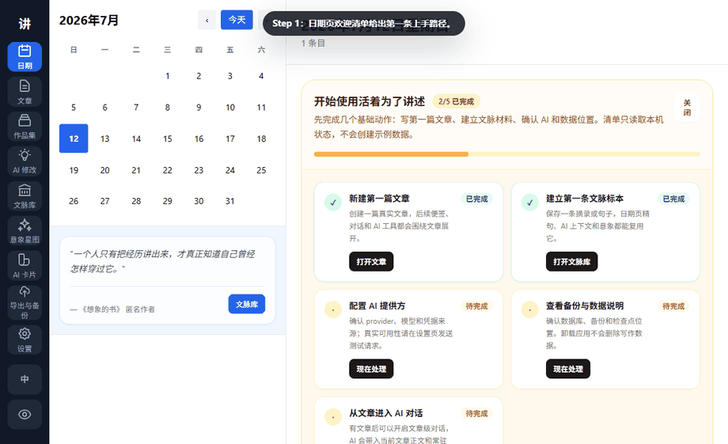
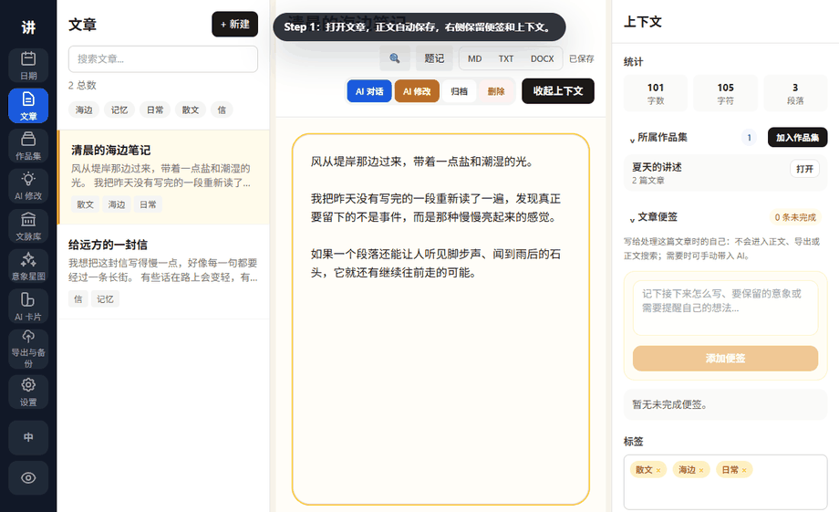
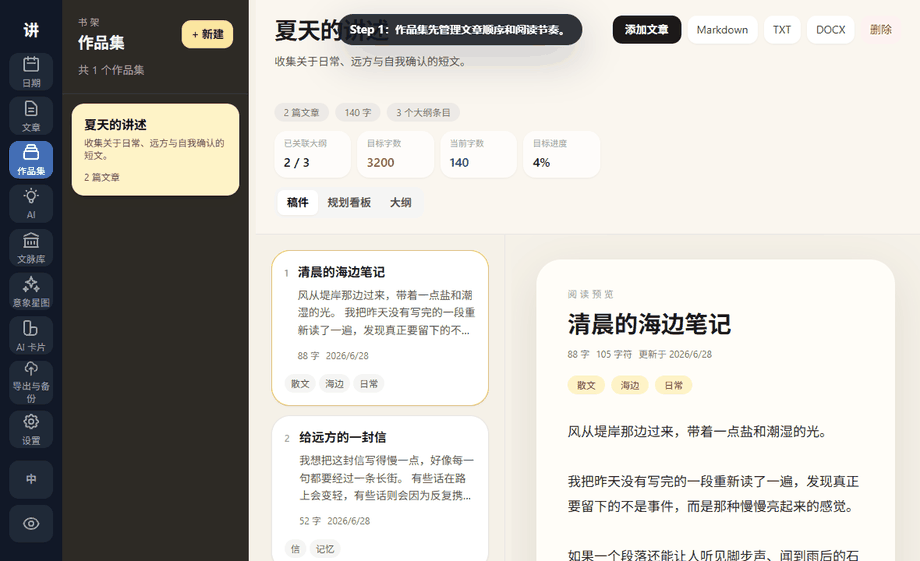
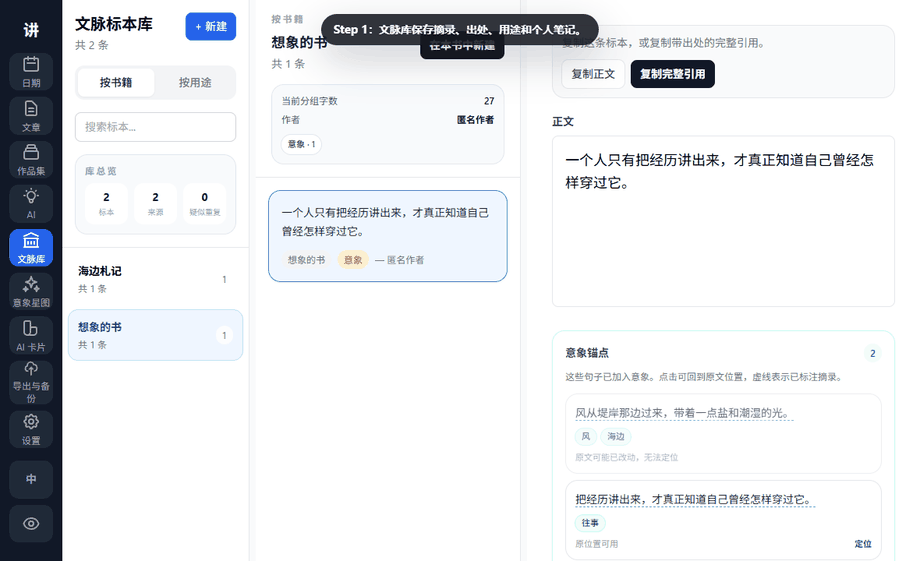
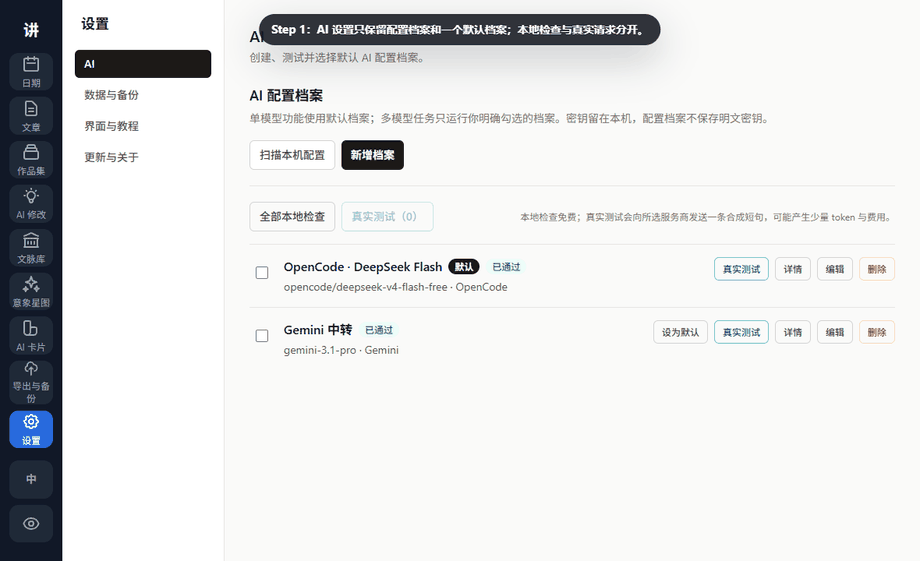
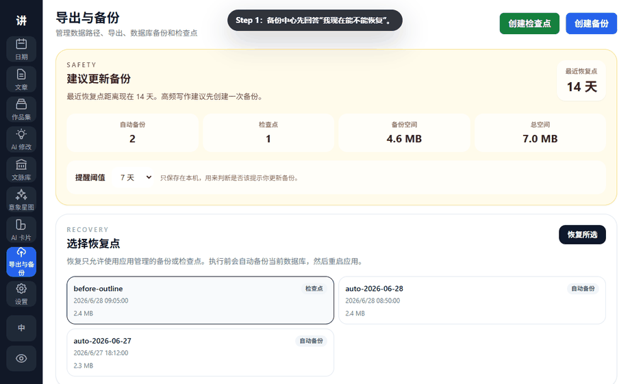

# Living to Tell GIF Tutorials

These GIFs are generated from a clean Playwright demo profile. They do not contain private writing, local usernames, account emails, API keys, or a real database. They show the core workflow; for detailed instructions, see the [official user guide](user-guide.md).

## 1. Sample Project: Understand the Full Workflow First



Goal: use a disposable sample project to understand how articles, collections, references, notes, and AI Cards connect.

Steps:

1. Open **Dates** and review the welcome checklist.
2. Click **创建示例项目**.
3. Click **打开作品集** to inspect the full demo project.
4. Return to Dates and click **删除示例** when done.

Expected result: the sample project can be created, opened, and removed. Removal only deletes IDs recorded by the sample marker.

Safety note: sample content is never created automatically and is never deleted by title or tag matching.

## 2. Article Writing: Draft, Notes, Versions, Focus



Goal: write from the Articles surface and create restore points before major edits.

Steps:

1. Open or create an article.
2. Write in the main editor; autosave handles normal drafting.
3. Use article notes for reminders and next-step ideas.
4. Open **Version History** and click **Save Current Version**.
5. Use focus mode when you want only the writing surface.

Expected result: body text, notes, and versions stay separate; focus mode removes surrounding panels.

Safety note: versions are meaningful checkpoints, not a record of every autosave.

## 3. Collection Planning: From Manuscript Structure to Board



Goal: organize multiple articles into one book project with a single structure tree and board.

Steps:

1. Open **Collections** and create or open a manuscript project.
2. If the interactive tutorial appears, use **Next** to walk through Manuscript Structure, Project Type, Unplanned Articles, Linked Article, Board, and Export; restart it later from Settings if needed.
3. In **Manuscript**, add top-level nodes such as parts, chapters, sections, essays, or scenes.
4. Select a chapter or group, then click **New Child**, or place **Unplanned Articles** under the selected node.
5. Select a structure node and edit title, type, parent, status, summary, target words, and linked article.
6. Switch to **Board** to scan idea, draft, revision, done, and parked items across the same tree.
7. Switch to **Export** to export the manuscript, or export a separate planning file for your own review.

Expected result: Collections use one clear manuscript structure tree; articles not yet in the tree stay in Unplanned Articles.

Safety note: removing an article from a collection does not delete the article. Linked Article only connects a structure node to a draft; it does not copy or move text. Once the tree has linked draft nodes, unplanned articles are not included automatically in manuscript export.

## 4. References and Motifs: From Excerpt to Star Map



Goal: save reusable reference material and connect recurring images, symbols, and source excerpts in the motif map.

Steps:

1. Save content, source title, author, usage, and personal notes in **Reference Library**.
2. Select text in an article or reference and right-click **加入意象星图**.
3. Open **Motif Star Map** to inspect node sizes, colors, and links.
4. Open motif details to review source excerpts and return to the original text.

Expected result: references preserve source context; motifs preserve recurring creative relationships.

Safety note: one excerpt can belong to several motifs. Removing it from one motif does not remove it everywhere.

## 5. AI Profiles, Article Editing, and AI Cards



Goal: configure one reliable default profile, compare article edits across explicitly selected models, and keep reusable style/character/scene context in AI Cards.

Steps:

1. In **Settings → AI**, review profile health, choose one default, and open the three-step profile wizard.
2. Run local checks first; send a minimal real test only for profiles you explicitly select.
3. Open **AI Edit** from an article or selection, choose Polish, Rewrite, Expand, or Continue, then select one or more profiles.
4. Read the first successful result immediately, switch to the paragraph difference, and open the write-back preview. More selected models can mean longer waits and higher provider cost.
5. Open the article-side **AI Chat** drawer for discussion without leaving the draft.
6. Open **AI Cards** to maintain style, character, and scene modules. Use **Copy as Prompt** when a card should become explicit AI context.

Expected result: AI Edit uses the selected article and exact selected profiles; output stays in preview until you explicitly copy or apply it, and article chat remains separate from write-back.

Safety note: local config existence does not prove remote model availability. Real tests can use tokens and cost money. Reconnection checks status without resending the provider request.

## 6. Export and Backup: Restore Points First



Goal: confirm that you can recover before major edits, exports, or upgrades.

Steps:

1. Open **Export & Backup** and review the safety summary.
2. Click **Create Checkpoint** and give it a readable name and note.
3. Review the combined restore-point list of checkpoints and automatic backups.
4. Select a restore point and click **Restore Selected** only when needed.
5. Use shortcut exports for the recently opened article or collection.

Expected result: restore points, data paths, and export shortcuts are visible in one place.

Safety note: restore first creates a backup of the current database. Export files and database backups serve different purposes.

## Regenerate GIFs

From the repository root:

```powershell
node .\tauri-mvp\scripts\record-tutorials.cjs
```

The script starts or reuses the Vite dev server on `127.0.0.1:1420`, mocks all backend API responses, captures step frames, and composes GIFs with Python Pillow. Intermediate frames are deleted.
