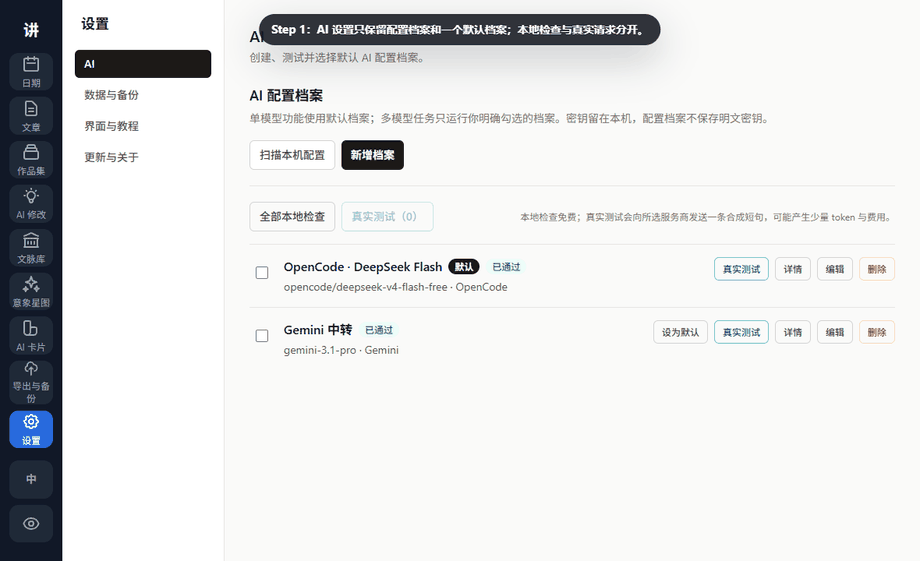
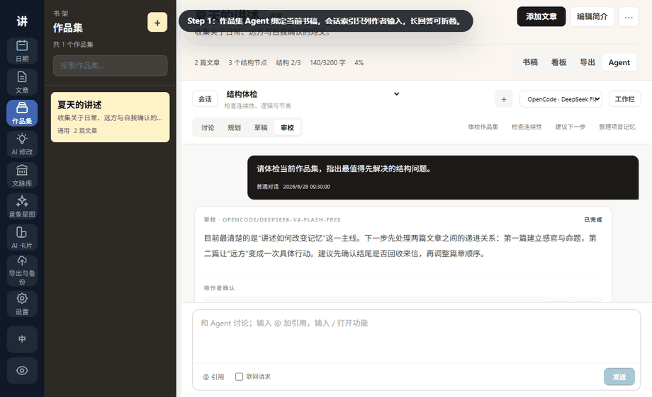
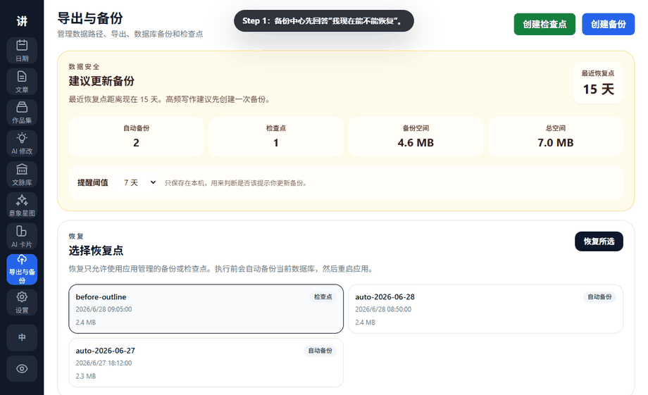

# 活着为了讲述 GIF 教程

这些 GIF 使用 Playwright 的干净 demo 数据生成，不包含真实文章、真实路径、账号、API key 或本地数据库。它们演示“主链路怎么走”，更细的说明见 [官方手册](user-guide.zh-CN.md)。

应用内还有四套聚光式互动教程：作品集、AI 修改、作品集 Agent、意象星图。第一次进入只显示轻量邀请；教程不会创建数据或发送 AI。之后可在 **设置 → 界面与教程** 重新启动任意教程。

## 1. 示例项目：先理解完整工作流


目标：第一次打开应用时，用可删除的示例项目理解文章、作品集、文脉、便签和 AI Card 如何连起来。

步骤：

1. 打开 **日期** 页，查看欢迎清单。
2. 点击 **创建示例项目**。
3. 点击 **打开作品集**，查看完整演示项目。
4. 回到日期页，点击 **删除示例** 清理演示内容。

完成后你应该看到：示例项目可以被创建、打开和删除；删除只清理 marker 记录的示例内容。

安全提醒：示例项目不会自动创建，也不会按标题或标签删除你的真实内容。

## 2. 文章写作：草稿、便签、版本和专注模式


目标：从文章页开始写作，并在大改前留下可恢复节点。

步骤：

1. 进入 **文章**，打开或创建一篇文章。
2. 在正文区直接写作；应用自动保存。
3. 用右侧文章便签记录临时提醒。
4. 打开 **历史版本**，点击 **保存当前版本**。
5. 需要沉浸写作时进入专注模式。

完成后你应该看到：正文、便签、历史版本是分开的；专注模式只保留写作区。

安全提醒：AI 或手动恢复前都应保留版本；版本不是每次自动保存的流水账，而是关键节点。

## 3. 作品集规划：从书稿结构到看板


目标：把多篇文章组织成一本书稿项目，并用统一的结构树和看板推进。

步骤：

1. 进入 **作品集**，新建或打开一本书稿项目。
2. 如果页面弹出互动教程，可以按 **下一步** 依次理解书稿结构、作品类型、未编排文章、关联文章、看板和导出；关闭后可在设置中重新显示。
3. 在 **书稿** 页新增顶层节点，例如分部、章节、辑、篇章或小节。
4. 选中一个章节或篇组，点 **新子项**，或把 **未编排文章** 放到当前节点下。
5. 选择一个结构节点，在详情区维护标题、类型、上级节点、状态、摘要、目标字数和关联文章。
6. 切到 **看板**，按构思、草稿、修订、完成、暂停查看同一棵树。
7. 切到 **导出**，按书稿结构导出正文，或导出仅供自己查看的规划文件。

完成后你应该看到：作品集不是两套列表，而是一棵清楚的书稿结构树；未进入树的文章会留在未编排区。

安全提醒：从作品集中移除文章不会删除原文章；关联文章只是连接结构节点和正文，不会复制或移动文章。已有结构关联文章时，未编排文章不会自动进入正文导出。

## 4. 文脉与意象：从摘录到星图


目标：保存有价值的摘录，并把反复出现的句子、意象和来源连接成星图。

步骤：

1. 在 **文脉库** 保存正文、出处、作者、用途和个人笔记。
2. 搜索会高亮标题、作者、标签、个人笔记和正文命中词；不用鼠标时可按上下键移动、Enter 打开。
3. 在文章或文脉正文中选中文字后右键，选择 **加入意象星图**。
4. 进入 **意象星图**，使用缩放、平移、适配、居中、密度和节点聚焦。
5. 手动建立作者确认的正式关系，或打开 **发现关联** 审阅默认未勾选的已有意象候选和只含名称的新概念候选。
6. 打开意象详情，查看来源锚点并回到原文。

完成后你应该看到：文脉负责“材料与出处”，意象把真实共现和作者确认的正式关系放在同一张图中，但不会制造“AI 边”。

安全提醒：同一句可以属于多个意象；AI 候选在选择并应用前不会进入星图，新概念只创建待丰富空节点，不会自动继续丰富。

## 5. AI 配置与文章修改上下文



目标：配好一个可靠的默认档案，主动选择文脉标本、AI Cards 和当前文章便签，再把同一份上下文交给明确勾选的模型对比。

步骤：

1. 在 **设置 → AI** 查看档案健康状态，选定唯一默认档案，并打开三步配置向导。
2. 先做本地检查，只对明确勾选的档案发送最小真实测试。
3. 从文章或选区进入 **AI 修改**，选择润色、改写、扩写或续写。
4. 在 **参考上下文** 中按需打开三个大选择器：文脉标本、AI Cards、文章便签。搜索、预览、暂存选择，最后确认；只查看不会附加。
5. 勾选一个或多个档案；每个模型收到同一份冻结文章与上下文快照。
6. 第一个模型成功后立即阅读结果，核对本轮参考名称，切换段落差异，再打开写回预览；选择模型越多，等待时间和供应商成本可能越高。
7. 在文章侧打开 **AI 对话** 抽屉，不离开正文也能讨论写法。

完成后你应该看到：AI 修改只使用当前文章、实际勾选档案和明确确认的参考资料；结果只在你明确复制或确认写回后才产生变化。

安全提醒：本地配置存在不等于模型可用；真实测试可能使用 token 并产生费用。重连只查询任务状态，不重新发送 provider 请求；切换文章会清空便签选择，避免串到另一篇正文。

## 6. 作品集 Agent：对话、记忆与提案



目标：把绑定作品集的 Agent 当作长期总编工作台使用，但不让普通对话自动变成书稿数据。

步骤：

1. 进入 **作品集 → Agent**，用会话列表和 Prompt 索引快速回到之前的问题。
2. 输入 `@` 或点 **引用**，只加入下一轮需要的结构节点、文章、AI Card、意象或文脉。
3. 打开工作栏，查看本轮会读什么、项目圣经、本机草稿和待确认提案。
4. 选择讨论、规划、草稿或审校。点击 **体检作品集** 等快捷任务后，先核对模型与上下文；只有 **确认运行** 才发请求。
5. 逐条应用、稍后处理或拒绝提案。只有应用“更新记忆”提案或手动保存项目圣经才改变长期 canon。

完成后你应该看到：会话可搜索、工作线彼此分开，而作者确认的项目圣经在整个作品集中共享。

安全提醒：普通对话、被拒绝提案和未应用草稿不会自动进入记忆；离开标签页后只恢复任务状态，不会重新发送 provider 请求。

## 7. 导出与备份：恢复点优先



目标：在大改、导出或升级前确认自己有恢复点。

步骤：

1. 进入 **导出与备份**，查看安全摘要。
2. 点击 **创建检查点**，写清楚名称和说明。
3. 查看检查点和自动备份组成的恢复点列表。
4. 需要恢复时选择恢复点，点击 **恢复所选** 并确认。
5. 用导出快捷操作导出最近文章或作品集。

完成后你应该看到：恢复点、数据路径、导出入口集中在同一个页面。

安全提醒：恢复前应用会自动备份当前数据库；导出文件和数据库备份不是同一种东西。

## 重新生成 GIF

从仓库根目录运行：

```powershell
node .\tauri-mvp\scripts\record-tutorials.cjs
```

脚本会启动或复用 `127.0.0.1:1420` 上的 Vite dev server，mock 所有后端接口，抓取步骤帧并用 Python Pillow 合成 GIF。中间帧会被删除。
