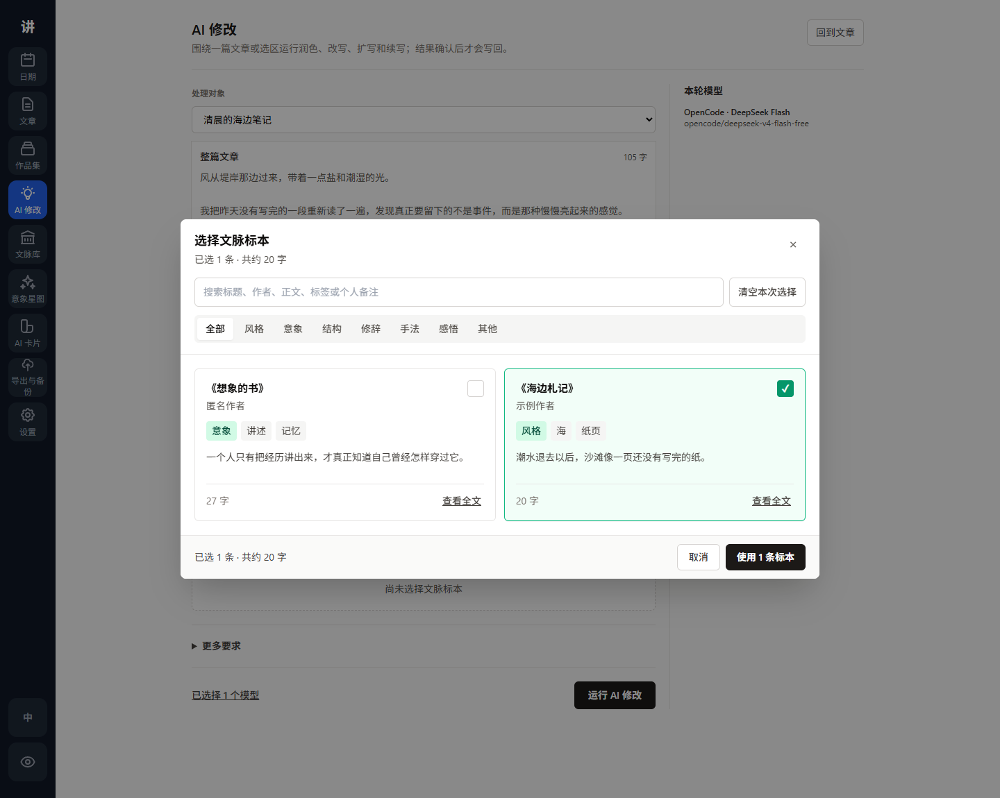
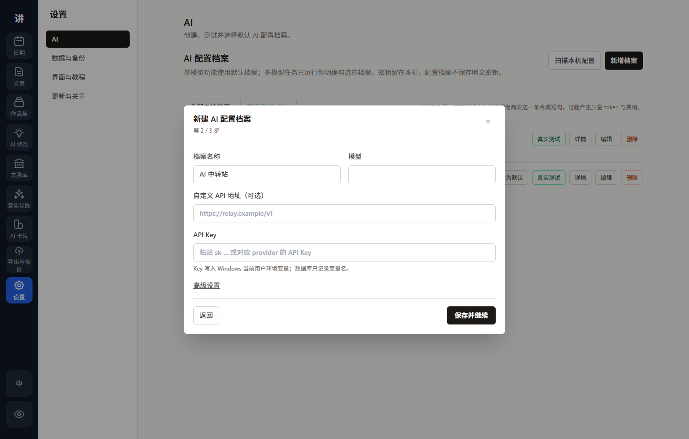
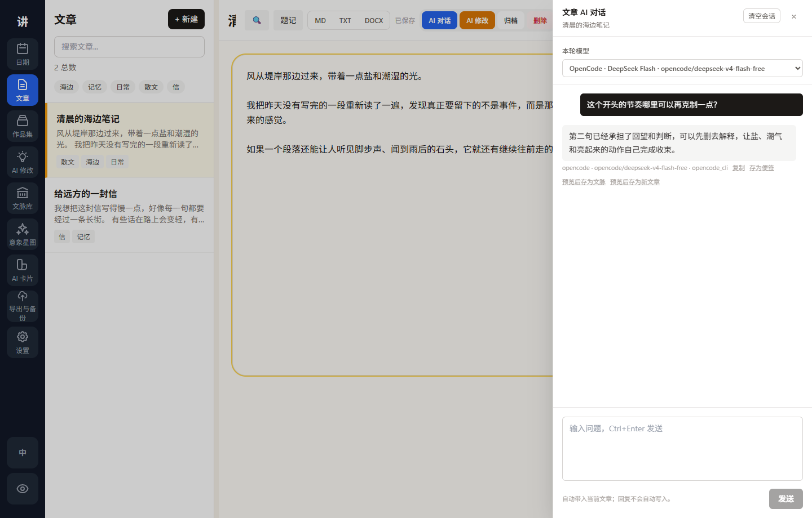

<div align="center">

# Living to Tell Tauri Preview

### The current Windows desktop preview for 活着为了讲述 / Living to Tell

[](CHANGELOG.md)
[](https://github.com/sidiangongyuan/living-to-tell/releases)
[](https://tauri.app/)
[](#download)
[](../LICENSE)

[Download](#download) · [Screenshots](#screenshots) · [Features](#features) · [Development](#development)

</div>

Living to Tell is a calm desktop app for writing articles, arranging them into collections, saving reference passages, and using AI without giving up control of the manuscript.

The Tauri preview is the current public direction. It uses a Vue frontend, a bundled FastAPI sidecar, and a local SQLite database.

## Screenshots

| Article Writing | Focus Mode |
| :---: | :---: |
|  |  |

| Collections | Reference Library |
| :---: | :---: |
|  |  |

| Article AI Edit | AI Profiles |
| :---: | :---: |
|  |  |

| Reference Specimen Picker | Profile Setup Wizard |
| :---: | :---: |
|  |  |

| Article AI Chat | First-Run Checklist |
| :---: | :---: |
|  |  |

| Export & Backup | Collection Agent |
| :---: | :---: |
|  |  |

## Features

### Writing

- Article editor with autosave, tags, full-text search, find/replace, and a collapsible context pane.
- Article notes live beside the current article without entering the manuscript.
- The article context pane shows motif anchors already linked in the current article, with navigation back to the source text or motif map.
- Article version history supports manual checkpoints, AI-before-apply snapshots, pre-restore snapshots, paragraph comparison, restore, clone, copy, and delete.
- Epigraphs can be edited as a separate section at the top of an article.
- Focus mode hides the surrounding interface and leaves only the writing area.
- Single-article export to Markdown, TXT, and DOCX.
- Date view for browsing daily writing activity, with a direct start-writing action on empty days.

### Collections

- Create article collections and add multiple articles at once.
- Use a compact project header, searchable shelf, and reading-first structure detail with an explicit edit mode.
- Choose a project type and manage one **Manuscript Structure** tree for hierarchy, order, linked drafts, and export.
- Use project-aware labels: novel part/chapter/scene, essay section/group/essay, nonfiction part/chapter/section.
- Link one article to one structure node, then add child nodes when a chapter needs several articles below it.
- Keep added-but-unplaced drafts in **Unplanned Articles** until they are placed into the tree.
- Switch to the board to review the same structure grouped by idea, draft, revision, done, and parked status.
- Export the manuscript to Markdown, TXT, or DOCX from the structure tree, and export a separate planning file when needed.
- Use the built-in collection tutorial to walk through Manuscript Structure, Project Type, Unplanned Articles, Linked Article, Board, and Export; restart it from Settings.
- Use the collection-bound Agent as a coauthoring workspace with named sessions, Discuss / Plan / Draft / Review modes, visible context summaries, persistent unapplied scene drafts, shared project canon, author-style evidence cycles, background runs, and reviewable proposals.

### Reference Library

- Save reference passages with source title, author, usage type, and personal notes.
- Read the passage and citation metadata first, then enter edit mode only when changes are needed.
- Browse by source book or usage.
- Jump from the daily quote card to the matching reference passage.
- Copy just the passage body, or copy a complete citation with title and author.

### Motif Star Map

- Save selected article or reference text into one or more motifs from a right-click menu.
- Reopen existing selections without creating duplicate excerpts, even when the saved range has drifted after editing.
- Use bidirectional source anchors to return from the article or motif archive to the marked source location.
- Explore motif co-occurrence through a visual star map with weighted nodes and links.
- Enrich a selected or newly typed concept with AI into a compact concept archive, then append or overwrite the motif note after review.
- Unlink an excerpt from the current motif without deleting the same excerpt from other motifs.

### AI

- Focused AI tools for polishing, rewriting, expanding, and continuing.
- Per-tool personal presets.
- AI Edit is bound to one real article or selection and never asks users to paste an unrelated text block.
- Reference specimens are a first-class AI Edit step with search, usage filters, large selectable cards, full-text preview, and staged confirmation. They are never recommended or attached automatically.
- Confirmed specimens are sent as method and style guidance with purpose, tags, personal notes, and text. All selected models receive the same run snapshot, with explicit rules against copying sentences or transplanting source facts and names.
- AI results are reviewed as one readable result at a time, with a paragraph diff before explicit write-back and an `AI_BEFORE_APPLY` version snapshot.
- Background article tasks show honest per-model waiting, success, and failure states; they continue after navigation and reconnect by status query without resending provider requests.
- AI Edit runs exactly the explicitly selected provider profiles and compares latency, tokens, cost, and actual transport when available. Selecting more models may increase wait time, token use, and provider cost.
- Article-scoped chat lives in a closable article drawer; drafts, history, and an in-flight reply survive closing.
- Standing chat instructions, copy actions, save-reply-as-article-note actions, and reviewed capture to reference material or new articles.
- AI Cards for style, character, and scene context, with readable sections, prompt-copy actions, type/source filters, and keyword search.
- AI card generation creates template-based style, character, and scene drafts with suggested tags for review before saving.
- Supports OpenAI-compatible APIs, Codex local auth, Gemini API/local config, Gemini CLI / OAuth, and OpenCode local auth.
- Raw API keys are not stored in app settings; only the selected credential source is saved.

### Desktop

- Windows installer builds with a bundled Python backend sidecar.
- Release builds discover the sidecar port automatically, so users do not need to run a backend manually.
- The Export & Backup center shows data, backup, and checkpoint paths, opens storage folders, creates backups/checkpoints, and exports the recent article or collection.
- Export & Backup now starts from recovery: safety summary, restore-point selection, backup age reminder, and a restore confirmation path that auto-backs up the current database first.
- Ctrl+K opens a command palette that now searches articles, collections, references, motifs, and AI cards as well as commands.
- The Date view includes a first-run checklist that reads local state without creating sample data.
- The first-run checklist can explicitly create a disposable sample project with articles, a collection manuscript structure, a reference, a writing note, and a scene AI Card.
- Startup uses a light splash window so users see progress while the backend sidecar starts.
- The app checks GitHub Releases in the background after startup and shows a clear update notice when a newer public build is available.
- Close behavior can be set to ask every time, minimize to tray, or exit directly.
- Settings show the current data directory, database, backup folder, checkpoint folder, and custom-directory status.
- Data-directory migration copies data and preserves the previous folder.
- Public preview uses light mode only; dark mode code remains available for a later full theme pass.

## Download

Download the latest public preview from [GitHub Releases](https://github.com/sidiangongyuan/living-to-tell/releases/tag/living-to-tell-v0.1.48).

Recommended Windows asset:

- `LivingToTell_0.1.48_x64-setup.exe`

Optional asset:

- `LivingToTell_0.1.48_x64_zh-CN.msi`

Windows SmartScreen may warn because preview builds are unsigned. Only run installers downloaded from this repository's release page.

## Quick Start

1. Install Living to Tell from the latest Release.
2. Open the app and go to Articles.
3. Create or select an article and start writing.
4. Use Collections to arrange multiple articles into a reading order.
5. Use the Reference Library to save quotes and source material.
6. Configure AI in Settings if you want AI tools or scoped chat.

## AI Setup

Open **Settings → AI** and create or import a profile. The three-step wizard keeps transport details in Advanced settings and lets the profile survive a failed real test without losing what you entered.

- OpenAI-compatible: set a base URL/model, choose the right wire API, and use `env:OPENAI_API_KEY` or Codex local auth.
- Gemini API: use `env:GEMINI_API_KEY` or import local Gemini configuration.
- Gemini CLI / OAuth: reuse a local Gemini CLI login. No API key field is required.
- OpenCode: reuse a local `opencode auth login` session. No API key field is required, and Settings can fetch the current OpenCode model list.

Choose exactly one profile as the default for single-model features. AI Edit can select one or more profiles, sends exactly those real profile IDs, and never silently adds the default profile. Saved health is shown as untested, passed, failed, or changed and needs retesting.

Use **Scan Local Configs** to discover local OpenCode, Codex/OpenAI, and Gemini configs. Discovery and **Check All Locally** are local only; choose profiles explicitly before sending minimal real test requests, which may consume tokens or incur provider cost.

OpenCode model fetching is live. On the current local OpenCode setup, the available models include:

- `opencode/big-pickle`
- `opencode/deepseek-v4-flash-free`
- `opencode/mimo-v2.5-free`
- `opencode/nemotron-3-ultra-free`
- `opencode/north-mini-code-free`

OpenAI-compatible, Gemini API, and Gemini CLI requests default to a 120 second local wait. Advanced users can tune these with `WRITER_OPENAI_TIMEOUT_SECONDS`, `WRITER_GEMINI_TIMEOUT_SECONDS`, or `WRITER_GEMINI_CLI_TIMEOUT_SECONDS`. OpenAI-compatible SDK retries are disabled so only an explicit new run can send another paid request.

For status-code, local-login, relay, transport, timeout, and billing guidance, see [AI Setup Troubleshooting](../docs/ai-troubleshooting.md).

## Data & Privacy

- Writing data is stored locally in SQLite at `%APPDATA%\LivingToTell\LivingToTell\living-to-tell.sqlite3` by default.
- The Windows installer usually places app files under `%LOCALAPPDATA%\活着为了讲述`; this is separate from your writing database.
- Uninstalling the app does not delete the writing database, backups, or checkpoints.
- Use **Settings → Data and Storage** to open or migrate the data directory. Migration copies data and keeps the old folder intact.
- First launch copies old Writer data from `%APPDATA%\Writer\Writer\writer.sqlite3` into the new location if it exists. The old database is retained.
- AI requests are sent only when you run an AI tool or send a chat message.
- API keys are read from environment variables or local provider configuration at runtime.
- Settings store the selected provider and credential source, not raw API keys.
- Use backups/checkpoints before major editing or migration tests.

## Development

Requirements:

- Windows
- Python 3.12 or a compatible local environment
- Node.js 20+
- Rust stable

Run the backend:

```powershell
cd tauri-mvp\backend
$env:WRITER_USE_DEV_DB = "1"
python run.py --dev
```

Run the frontend:

```powershell
cd tauri-mvp\frontend
npm install
npm run dev
```

Build the release package:

```powershell
cd tauri-mvp
.\build-release.ps1 -PythonExe python
```

Release artifacts are written under:

```text
tauri-mvp\frontend\src-tauri\target\release\
tauri-mvp\frontend\src-tauri\target\release\bundle\nsis\
tauri-mvp\frontend\src-tauri\target\release\bundle\msi\
```

## Verification

```powershell
python -m pytest
cd tauri-mvp\frontend
npm test
npm run test:e2e
npm run build
cargo check --manifest-path src-tauri\Cargo.toml
```

## Roadmap

- Full dark theme pass before re-enabling the theme switcher.
- Broader first-run onboarding and a sample project.
- Optional cloud sync for writers who want the same local-first workspace across devices.
- Signed Windows builds or published checksums for preview installers.
- Richer reference-library views and AI report actions.
- More manuscript-level outline/export workflows on top of collection planning.
- Richer graph views for themes, character links, arguments, references, and AI-generated ideas.
- macOS and Linux packages after the Windows workflow is mature.

## License

MIT © Living to Tell contributors
